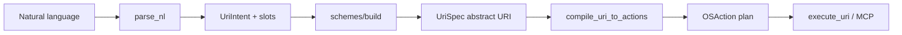

# nlp2uri


## AI Cost Tracking

   
  

- 🤖 **LLM usage:** $4.4330 (15 commits)
- 👤 **Human dev:** ~$571 (5.7h @ $100/h, 30min dedup)

Generated on 2026-06-07 using [openrouter/qwen/qwen3-coder-next](https://openrouter.ai/qwen/qwen3-coder-next)

---

Python library and CLI — **kompilator NL → URI → akcje OS** dla operacji desktopowych.

Wejście (naturalny język):

- „otwórz VS Code w folderze ~/projekty/nlp2uri”
- „zrób screenshot aktywnego okna przeglądarki”
- „otwórz plik invoice-2025.pdf”

Wyjście:

1. **Abstrakcyjny URI** (RFC 3986, niezależny od OS)
2. **Plan akcji** `OSAction[]` — konkretne komendy per platforma
3. (Opcjonalnie) wykonanie lub payload MCP (`text/uri-list`)

## Architektura



### Warstwy

| Warstwa | Moduł | Opis |
|---------|-------|------|
| NLP → intencja | `parse_nl` | Heurystyki EN + PL → `UriIntent` |
| Intencja → URI | `schemes/*` | Abstrakcyjne schemy OS-neutral |
| URI → OS | `compile` | `compile_uri_to_actions()` |
| Wykonanie | `runtime` | `subprocess` / dry-run |
| MCP | `mcp` | `text/uri-list`, tool payloads |

## Abstrakcyjne schemy URI

| Scheme | Przykład | Znaczenie |
|--------|----------|-----------|
| `app://` | `app://vscode/open?path=/home/tom/...` | Otwórz aplikację / IDE |
| `app://file/open` | `app://file/open?path=/tmp/x.pdf` | Otwórz plik |
| `desktop-screenshot://` | `desktop-screenshot://window?title=Chrome&mode=active` | Screenshot okna/ekranu |
| `desktop-window://` | `desktop-window://focus?name=slack` | Fokus okna |
| natywne | `vscode://`, `cursor://`, `file://`, `ms-settings:` | Passthrough do handlera OS |

Metadata `native_uri` zawiera deep-link IDE (`vscode://file/...`) gdy istnieje.

## Konfiguracja (`nlp2uri.yaml`)

Domyślne ustawienia w pliku `nlp2uri.yaml` (auto-tworzony przy pierwszym uruchomieniu):

```yaml
platform: auto          # auto | linux | darwin | windows
host_platform: linux  # ostatnio wykryty host (informacyjnie)
locale: null
dry_run: false
capture_dir: /tmp/nlp2uri-captures
```

Kolejność wyboru platformy: `--platform` → `NLP2URI_PLATFORM` → `nlp2uri.yaml` → auto-detect OS.

```bash
nlp2uri config show --json    # efektywna konfiguracja
nlp2uri config init           # zapisz domyślny nlp2uri.yaml
```

Ścieżki szukania configu: `NLP2URI_CONFIG` → `./nlp2uri.yaml` → `~/.config/nlp2uri/nlp2uri.yaml`.

## Quick start

```bash
pip install -e ".[dev]"

# Platforma wykrywana automatycznie (bez --platform)
nlp2uri plan "otwórz vscode w folderze ~/github/semcod/nlp2uri" --json
nlp2uri resolve "zrób screenshot aktywnego okna przeglądarki" --json
nlp2uri execute "open firefox" --dry-run
```

## Sterowanie IDE (Koru / koruide)

Warstwa planowania `koru.control.v1` — NL → URI → drive przez socket koruide (nie wykonuje samodzielnie klawiatury; wymaga działającego daemona Koru + pluginu VSIX w IDE).

```bash
export KORU_AUTOPILOT_INSTANCE=cursor-main   # socket instancji Cursor

# Plan (NL → control plan + URI)
nlp2uri control plan "wyślij probe do cursor" --text "treść wiadomości" --json

# Wykonanie (plan + drive); workspace z live status gdy daemon działa
nlp2uri control execute "probe test" --text "hello" --json

# Tylko wklejenie (submit=false — stabilniejsze na Cursor Glass UI)
nlp2uri control execute "..." --text "..." --no-submit --json

# Indeks URI z autopilot status
nlp2uri control list-uris --json
```

Odpowiedniki w Koru: `koru ide control plan|execute|list-uris` oraz narzędzia MCP `koru_ide_*` (wymagają `koru mcp-serve`, nie są komendami shell).

| Flaga | Znaczenie |
|-------|-----------|
| `--text` / `--text-file` | Treść wiadomości (osobno od promptu NL) |
| `--ide` / `--instance` | Lane IDE (`cursor-main` → `cursor`) |
| `--project` | Katalog do dopasowania `workspace` z plugin status |
| `--no-submit` | Paste bez Enter / submit |
| `--dry-run` | Tylko plan, bez drive |

Dla `cursor` + `submit=true` plan domyślnie ustawia `strategy_hint=submit_alt_glass_first` (kolejność submit w probe ladder).

## Python API (service facade)

```python
from nlp2uri import NLP2URIService
from nlp2uri.models import HostPlatform

svc = NLP2URIService.default()  # ładuje nlp2uri.yaml + auto-detect

plan = svc.from_prompt("otwórz vscode w folderze /tmp/foo")
print(plan.uri)                    # app://vscode/open?path=/tmp/foo
print(plan.actions[0].argv())      # ['xdg-open', 'vscode://file/tmp/foo']

payload = svc.handle_prompt("open firefox", dry_run=True)  # prompt → URI → run
```

## Adaptery i integratory (reużywalne powierzchnie)

| Warstwa | Użycie | Moduł |
|---------|--------|-------|
| **Service** | `NLP2URIService.from_prompt()` / `handle_uri()` | `nlp2uri.service` |
| **CLI** | `nlp2uri plan\|resolve\|compile\|execute` | `nlp2uri.adapters.cli` |
| **Shell** | `eval "$(nlp2uri shell export '…')"` | `nlp2uri.adapters.shell` |
| **REST** | `nlp2uri-serve --port 8766` | `nlp2uri.integrators.rest_server` |
| **MCP** | `nlp2uri-mcp` (stdio JSON-RPC) | `nlp2uri.integrators.mcp_server` |

### REST (`POST /v1/plan`)

```bash
curl -s -X POST http://127.0.0.1:8766/v1/plan \
  -H 'Content-Type: application/json' \
  -d '{"prompt":"open firefox"}'
```

### MCP (Cursor / Windsurf)

```json
{ "mcpServers": { "nlp2uri": { "command": "nlp2uri-mcp" } } }
```

Tools: `nlp2uri_plan`, `nlp2uri_resolve`, `nlp2uri_compile`, `nlp2uri_execute`, `nlp2uri_handle`.

### Shell

```bash
eval "$(nlp2uri shell export 'open firefox')"
echo "$NLP2URI_URI"    # app://firefox/open
$nlp2uri-run           # alias do skompilowanej komendy
```

### Własny adapter

```python
from nlp2uri.adapters.base import AdapterRequest
from nlp2uri.adapters.rest import RestAdapter

response = RestAdapter().dispatch("plan", {"prompt": "capture screen", "platform": "linux"})
print(response.data["uri"])
```

## Standardy

| Standard | Rola |
|----------|------|
| [RFC 3986](https://www.rfc-editor.org/rfc/rfc3986) | Składnia URI (`scheme`, `path`, `query`) |
| [RFC 8089](https://www.rfc-editor.org/rfc/rfc8089) | `file://` |
| [RFC 9110](https://www.rfc-editor.org/rfc/rfc9110) | `http(s)://` |
| [Freedesktop Desktop Entry](https://specifications.freedesktop.org/desktop-entry-spec/latest/) | `.desktop`, `x-scheme-handler/<scheme>` |
| [XDG Desktop Portal](https://flatpak.github.io/xdg-desktop-portal/) | Screenshot Wayland |
| Windows URI activation | `ms-settings:`, rejestracja schemów |
| macOS URL Schemes | `CFBundleURLSchemes` w `Info.plist` |
| MCP `text/uri-list` | Lista URI dla hosta / MCP Apps |

## Przydatne biblioteki

| Biblioteka | Kiedy |
|------------|-------|
| `urllib.parse`, `webbrowser`, `subprocess` | Już używane (stdlib) |
| `psutil` | PID → okno |
| `pyxdg` | Parsowanie `.desktop` |
| `dbus-python` + PyGObject | XDG Portal screenshot |
| `pywin32` | Win32 `SetForegroundWindow` |
| `pyobjc` / Quartz | macOS window ID |
| `spaCy` / `transformers` | Zamiast heurystyk regex |
| `nlp2dsl` / `nlp2cmd-intent` | IntentIR z LLM (jak `nlpshim`) |

## Testy i Docker

```bash
python -m pytest
docker compose build && docker compose run --rm nlp2uri-test
./examples/run-e2e.sh
```

Przykłady per kategoria: [examples/README.md](examples/README.md).

W Dockerze:

- unit: NLP → URI → `OSAction`
- integracja: rejestracja `testapp://` przez `.desktop` + `xdg-open` (`NLP2URI_INTEGRATION=1`)

## CQRS + ES + Protobuf (generowanie driverów i API)

Każdy typ URI ma własne drzewo **commands / events / queries / driver / api**:

```bash
cd schemas && make all          # scaffold + MCP schemas + driver stubs
cd schemas && make proto        # buf → Python gRPC + OpenAPI (wymaga buf CLI)
```

→ [schemas/README.md](schemas/README.md) · [schemas/uri_cqrs_es.v1.md](schemas/uri_cqrs_es.v1.md)

## Orchestracja ekosystemu (MCP, usługi, artefakty, getv)

Pełny przewodnik z przykładami uruchomienia i kontroli wielu backendów:

- **[docs/orchestration.md](docs/orchestration.md)** — URI + MCP + todomat + koru + scenariusze E2E
- [docs/system_map_uri.v1.md](docs/system_map_uri.v1.md) — `command://`, `artifact://`, `service://`, …
- [docs/getv_uri.v1.md](docs/getv_uri.v1.md) — `getv://` zmienne środowiskowe
- [docs/mcp-tools.md](docs/mcp-tools.md) — lista narzędzi `nlp2uri-mcp`

```bash
pip install -e ".[envmap]"    # getv + env2llm
nlp2uri list-getv --json
nlp2uri resolve-getv "GROQ_API_KEY" --json
nlp2uri list-system-uris --example-dir ~/github/wronai/nlp2dsl/examples/01-invoice --json
```

## Plan rozwoju

[docs/roadmap.md](docs/roadmap.md) · [docs/mcp-tools.md](docs/mcp-tools.md) · CI: `.github/workflows/ci.yml`

## Relacja z ekosystemem Semcod

- **`nlpshim`** — NLP → DSL / workflow
- **`nlp2uri`** — NLP → URI → akcje (desktop, getv, SystemMap, MCP)
- **`todomat`** — orchestrator MCP/HTTP (curllm, nlp2dsl, iterun, nlp2uri)
- **`koru`** — bridge MCP `koru_desktop_uri_*` + planfile tickets
- **`getv`** — zmienne env → `getv://` URI

## License

Licensed under Apache-2.0.
