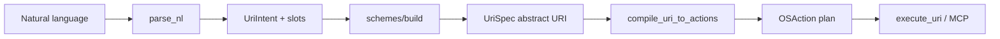

# nlp2uri


## AI Cost Tracking

   
  

- 🤖 **LLM usage:** $0.1500 (1 commits)
- 👤 **Human dev:** ~$100 (1.0h @ $100/h, 30min dedup)

Generated on 2026-06-06 using [openrouter/qwen/qwen3-coder-next](https://openrouter.ai/qwen/qwen3-coder-next)

---


Python library and CLI — **kompilator NL → URI → akcje OS** dla operacji desktopowych.

Wejście (naturalny język):

- „otwórz VS Code w folderze ~/projekty/nlp2uri”
- „zrób screenshot aktywnego okna przeglądarki”
- „otwórz plik invoice-2025.pdf”

Wyjście:

1. **Abstrakcyjny URI** (RFC 3986, niezależny od OS)
2. **Plan akcji** `OSAction[]` — konkretne komendy per platforma
3. (Opcjonalnie) wykonanie lub payload MCP (`text/uri-list`)

## Architektura



### Warstwy

| Warstwa | Moduł | Opis |
|---------|-------|------|
| NLP → intencja | `parse_nl` | Heurystyki EN + PL → `UriIntent` |
| Intencja → URI | `schemes/*` | Abstrakcyjne schemy OS-neutral |
| URI → OS | `compile` | `compile_uri_to_actions()` |
| Wykonanie | `runtime` | `subprocess` / dry-run |
| MCP | `mcp` | `text/uri-list`, tool payloads |

## Abstrakcyjne schemy URI

| Scheme | Przykład | Znaczenie |
|--------|----------|-----------|
| `app://` | `app://vscode/open?path=/home/tom/...` | Otwórz aplikację / IDE |
| `app://file/open` | `app://file/open?path=/tmp/x.pdf` | Otwórz plik |
| `desktop-screenshot://` | `desktop-screenshot://window?title=Chrome&mode=active` | Screenshot okna/ekranu |
| `desktop-window://` | `desktop-window://focus?name=slack` | Fokus okna |
| natywne | `vscode://`, `cursor://`, `file://`, `ms-settings:` | Passthrough do handlera OS |

Metadata `native_uri` zawiera deep-link IDE (`vscode://file/...`) gdy istnieje.

## Quick start

```bash
pip install -e ".[dev]"

# Pełny plan: URI + OSActions
nlp2uri plan "otwórz vscode w folderze ~/github/semcod/nlp2uri" --platform linux --json

# Tylko URI
nlp2uri resolve "zrób screenshot aktywnego okna przeglądarki" --platform linux --json

# URI → komendy
nlp2uri compile "desktop-screenshot://window?title=Chrome&mode=active" --platform linux --json

# Dry-run (bezpieczne w CI/Docker)
nlp2uri execute "open firefox" --platform linux --dry-run
```

## Python API

```python
from nlp2uri import nlp2uri, compile_uri_to_actions, execute_uri
from nlp2uri.models import HostPlatform

plan = nlp2uri(
    "otwórz vscode w folderze /tmp/foo",
    os=HostPlatform.LINUX,
)
print(plan.uri)       # app://vscode/open?path=/tmp/foo
print(plan.intent)    # open_app
print(plan.slots)     # {"app": "vscode", "resource": "/tmp/foo", ...}
print(plan.actions[0].argv())  # ['xdg-open', 'vscode://file/tmp/foo']

result = execute_uri(plan.uri, platform=HostPlatform.LINUX, dry_run=True)
```

## MCP server

```python
from nlp2uri.mcp import tool_resolve_desktop_action, tool_execute_desktop_uri

# Tool 1: NL → URI + plan (zwraca text/uri-list)
tool_resolve_desktop_action("screenshot window titled Firefox", platform=HostPlatform.LINUX)

# Tool 2: wykonaj URI (lub dry-run)
tool_execute_desktop_uri("desktop-screenshot://screen", platform=HostPlatform.LINUX, dry_run=True)
```

Host MCP może mapować `desktop-screenshot://...` na backend typu `mcp-desktop-pro` zamiast bezpośredniego `subprocess`.

## Standardy

| Standard | Rola |
|----------|------|
| [RFC 3986](https://www.rfc-editor.org/rfc/rfc3986) | Składnia URI (`scheme`, `path`, `query`) |
| [RFC 8089](https://www.rfc-editor.org/rfc/rfc8089) | `file://` |
| [RFC 9110](https://www.rfc-editor.org/rfc/rfc9110) | `http(s)://` |
| [Freedesktop Desktop Entry](https://specifications.freedesktop.org/desktop-entry-spec/latest/) | `.desktop`, `x-scheme-handler/<scheme>` |
| [XDG Desktop Portal](https://flatpak.github.io/xdg-desktop-portal/) | Screenshot Wayland |
| Windows URI activation | `ms-settings:`, rejestracja schemów |
| macOS URL Schemes | `CFBundleURLSchemes` w `Info.plist` |
| MCP `text/uri-list` | Lista URI dla hosta / MCP Apps |

## Przydatne biblioteki

| Biblioteka | Kiedy |
|------------|-------|
| `urllib.parse`, `webbrowser`, `subprocess` | Już używane (stdlib) |
| `psutil` | PID → okno |
| `pyxdg` | Parsowanie `.desktop` |
| `dbus-python` + PyGObject | XDG Portal screenshot |
| `pywin32` | Win32 `SetForegroundWindow` |
| `pyobjc` / Quartz | macOS window ID |
| `spaCy` / `transformers` | Zamiast heurystyk regex |
| `nlp2dsl` / `nlp2cmd-intent` | IntentIR z LLM (jak `nlpshim`) |

## Testy i Docker

```bash
python -m pytest
docker compose build && docker compose run --rm nlp2uri-test
bash examples/run_all.sh
```

W Dockerze:

- unit: NLP → URI → `OSAction`
- integracja: rejestracja `testapp://` przez `.desktop` + `xdg-open` (`NLP2URI_INTEGRATION=1`)

## Relacja z ekosystemem Semcod

- **`nlpshim`** — NLP → DSL / workflow
- **`nlp2uri`** — NLP → URI → akcje desktopowe (MCP, screenshot, focus, open app)
- **`koru`** — `portal_capture.py` jako wzorzec dla Wayland screenshot

## License

Licensed under Apache-2.0.
