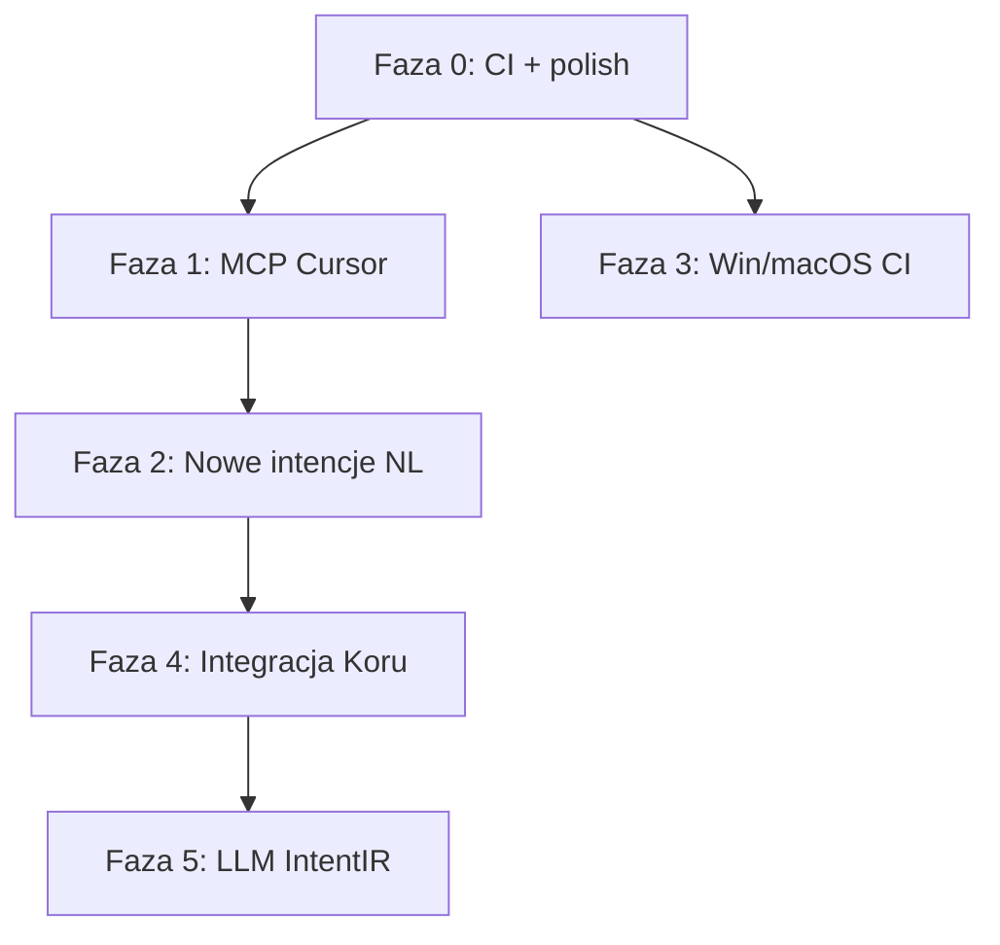

# nlp2uri — plan rozwoju (kolejność)

Stan wyjściowy (2026-06-06): **43 testy OK**, E2E Linux zielone, pipeline
`NL → Intent → URI → OSAction → execute` działa z `nlp2uri.yaml` i auto-detect platformy.

---

## Faza 0 — Domknięcie jakości ✅ (2026-06-06)

**Cel:** zero ostrzeżeń, stabilny CI, jednoznaczna dokumentacja uruchomienia.

| # | Zadanie | Deliverable | Status |
|---|---------|-------------|--------|
| 0.1 | Weryfikacja `nlp2uri-serve` | `e2e.sh` + CI guard | ✅ |
| 0.2 | CI workflow | `.github/workflows/ci.yml` | ✅ |
| 0.3 | `CHANGELOG` + `0.2.0` | semver | ✅ |
| 0.4 | Win/macOS dry-run matrix | job `test-dry-run-matrix` | ✅ |

---

## Faza 1 — MCP w Cursor / Windsurf (prawie done)

**Cel:** agent w IDE może wołać `nlp2uri` bez ręcznej konfiguracji.

| # | Zadanie | Deliverable | Status |
|---|---------|-------------|--------|
| 1.1 | Szablon MCP config | `mcp-config.cursor.json` | ✅ |
| 1.2 | Dokumentacja narzędzi | `docs/mcp-tools.md` | ✅ |
| 1.3 | E2E MCP w CI | `mcp-stdio/e2e.sh` w workflow | ✅ |
| 1.4 | Handoff desktop backend | `docs/mcp-tools.md` sekcja delegate | ✅ |
| 1.5 | Test na żywym Cursor | manual smoke | ⏳ |

**Przykład użycia w Cursor:**

```json
{
  "mcpServers": {
    "nlp2uri": {
      "command": "nlp2uri-mcp",
      "env": { "NLP2URI_CONFIG": "/path/to/nlp2uri.yaml" }
    }
  }
}
```

---

## Faza 2 — Rozszerzenie intencji NL ✅ (2026-06-06)

**Cel:** więcej operacyjnych scenariuszy desktopowych z opisu NL.

| # | Intencja NL (przykład) | URI | Parser | Status |
|---|------------------------|-----|--------|--------|
| 2.1 | „otwórz terminal w folderze ~/proj” | `app://terminal/open?path=…` | `_parse_terminal` | ✅ |
| 2.2 | „przenieś okno Slack na drugi monitor” | `desktop-window://move?title=Slack&screen=1` | `_parse_window_move` | ✅ |
| 2.3 | „zrób screenshot okna Edge” | `desktop-screenshot://window?title=Edge` | `_parse_capture` | ✅ |
| 2.4 | „otwórz Cursor z projektem X” | `app://cursor/open?path=…` | `_parse_ide_project` + PL | ✅ |
| 2.5 | „otwórz ustawienia sieci” | `ms-settings:network` / `app://settings/network` | `_parse_settings_panel` | ✅ |

| # | Zadanie | Deliverable | Status |
|---|---------|-------------|--------|
| 2.6 | `compile.py` — `desktop-window://move` | per-OS (xdotool/wmctrl/osascript/powershell) | ✅ |
| 2.7 | Testy per intencja | `tests/test_intents_phase2.py` | ✅ |
| 2.8 | Examples | `examples/resolve/new-intents/e2e.sh` | ✅ |

**Zależności:** Faza 1 (MCP pozwala testować z agenta).

---

## Faza 3 — E2E Windows / macOS (3–4 dni)

**Cel:** potwierdzić executory poza dry-run na prawdziwych hostach.

| # | Zadanie | Platforma | Deliverable |
|---|---------|-----------|-------------|
| 3.1 | Manual smoke checklist | Win | `docs/smoke-windows.md` |
| 3.2 | Manual smoke checklist | macOS | `docs/smoke-macos.md` |
| 3.3 | GitHub Actions `windows-latest` | Win | job: pytest (dry-run only) |
| 3.4 | GitHub Actions `macos-latest` | macOS | job: pytest (dry-run only) |
| 3.5 | Opcjonalny self-hosted runner | Win/mac | real execute w guarded env |

**Kryterium done:** `compile` + `execute --dry-run` green na 3 OS w CI; real execute udokumentowane manualnie.

**Zależności:** Faza 0 (CI baseline).

---

## Faza 4 — Integracja z Koru / ekosystem Semcod (w toku)

**Cel:** `nlp2uri` jako narzędzie w mesh MCP Koru, nie osobna wyspa.

| # | Zadanie | Deliverable | Status |
|---|---------|-------------|--------|
| 4.1 | Pakiet w monorepo lub dependency | `koru[desktop]` → `nlp2uri>=0.3` | ✅ |
| 4.2 | MCP tool w `koru mcp-serve` | `koru_desktop_uri_plan`, `koru_desktop_uri_handle` | ✅ |
| 4.3 | Most do `portal_capture.py` | Wayland screenshot przez XDG Portal (`KORU_PORTAL_CAPTURE`) | ✅ |
| 4.4 | `nlpshim` bridge | `NLP2CMD_INTEGRATION=1` → IntentIR metadata w plan | ✅ (metadata) |

**Zależności:** Faza 1 + 2.

---

## Faza 5 — SystemMap URI + NLP (w toku)

**Cel:** URI jako warstwa nad `env2llm.SystemMapIR`; heurystyki + IntentIR.

| # | Zadanie | Deliverable | Status |
|---|---------|-------------|--------|
| 5.0 | `system_map_uri.v1` spec | `docs/system_map_uri.v1.md` | ✅ |
| 5.1 | `nlp2uri.systemmap` | `build_uri_index`, `resolve_prompt_against_system_map` | ✅ |
| 5.2 | `command://` compile handoff | nlp2dsl worker / MCP | ⏳ |
| 5.3 | `IntentIR` → `UriIntent` mapper | `nlp2uri/intent_bridge.py` | ⏳ |
| 5.4 | Fallback chain | SystemMap → regex parsers (desktop) | ⏳ |
| 5.5 | TestQL scenariusze | `testql-scenarios/nlp2uri/*.testql.yaml` | ⏳ |

**Zależności:** Faza 4 + `env2llm>=0.1.3` (`pip install nlp2uri[envmap]`).

---

## Kolejność wykonania (skrót)



**Rekomendowany start:** Faza 0 → Faza 1 → Faza 2 (równolegle Faza 3 jeśli masz runnery Win/Mac).

---

## Metryki sukcesu

| Metryka | Teraz | Cel Faza 2 | Cel Faza 4 |
|---------|-------|------------|------------|
| Testy pytest | 43 | 55+ (59) | 65+ |
| MCP tools | 5 | 5 + docs | zagnieżdżone w Koru |
| Intencje NL | 8 | 13+ | IntentIR |
| Platformy CI | Linux | Linux | Linux + Win + macOS dry-run |

---

## Szybkie komendy weryfikacji (po każdej fazie)

```bash
cd ~/github/semcod/nlp2uri
pip install -e ".[dev]"
python -m pytest -q
bash examples/run-e2e.sh
nlp2uri config show --json
nlp2uri plan "open firefox" --json
```
