# System Architecture Analysis
<!-- generated in 0.00s -->

## Overview

- **Project**: /home/tom/github/semcod/nlp2uri
- **Primary Language**: python
- **Languages**: python: 36, shell: 10, yaml: 3, toml: 1, yml: 1
- **Analysis Mode**: static
- **Total Functions**: 148
- **Total Classes**: 21
- **Modules**: 52
- **Entry Points**: 96

## Architecture by Module

### src.nlp2uri.config
- **Functions**: 17
- **Classes**: 1
- **File**: `config.py`

### src.nlp2uri.compile
- **Functions**: 11
- **File**: `compile.py`

### src.nlp2uri.adapters.mcp
- **Functions**: 11
- **Classes**: 1
- **File**: `mcp.py`

### src.nlp2uri.integrators.mcp_server
- **Functions**: 10
- **File**: `mcp_server.py`

### src.nlp2uri.service
- **Functions**: 10
- **Classes**: 1
- **File**: `service.py`

### src.nlp2uri.platforms.base
- **Functions**: 9
- **Classes**: 1
- **File**: `base.py`

### src.nlp2uri.models
- **Functions**: 7
- **Classes**: 7
- **File**: `models.py`

### src.nlp2uri.integrators.rest_server
- **Functions**: 7
- **Classes**: 1
- **File**: `rest_server.py`

### src.nlp2uri.cli
- **Functions**: 6
- **File**: `cli.py`

### src.nlp2uri.platforms.linux
- **Functions**: 6
- **Classes**: 1
- **File**: `linux.py`

### src.nlp2uri.platforms.windows
- **Functions**: 5
- **Classes**: 1
- **File**: `windows.py`

### src.nlp2uri.platforms.macos
- **Functions**: 5
- **Classes**: 1
- **File**: `macos.py`

### src.nlp2uri.mcp
- **Functions**: 5
- **File**: `mcp.py`

### src.nlp2uri.schemes.util
- **Functions**: 5
- **File**: `util.py`

### src.nlp2uri.adapters.base
- **Functions**: 5
- **Classes**: 3
- **File**: `base.py`

### src.nlp2uri.schemes.desktop
- **Functions**: 4
- **File**: `desktop.py`

### src.nlp2uri.adapters.rest
- **Functions**: 4
- **Classes**: 1
- **File**: `rest.py`

### src.nlp2uri.parse_nl
- **Functions**: 3
- **File**: `parse_nl.py`

### src.nlp2uri.schemes.build
- **Functions**: 2
- **File**: `build.py`

### src.nlp2uri.resolve
- **Functions**: 2
- **File**: `resolve.py`

## Key Entry Points

Main execution flows into the system:

### src.nlp2uri.cli.main
- **Calls**: src.nlp2uri.cli._build_parser, parser.parse_args, CliAdapter, bool, cli.handle, response.to_dict, src.nlp2uri.cli._emit, src.nlp2uri.config.ensure_config

### src.nlp2uri.adapters.rest.RestAdapter.dispatch
- **Calls**: isinstance, self._service_for, self.body_to_request, AdapterResponse, AdapterResponse, svc.from_prompt, AdapterResponse, svc.resolve

### src.nlp2uri.adapters.cli.CliAdapter.handle
- **Calls**: self._service_for, AdapterResponse, svc.from_prompt, AdapterResponse, svc.resolve, AdapterResponse, svc.compile, AdapterResponse

### src.nlp2uri.platforms.linux.LinuxExecutor._capture
- **Calls**: Path, out_dir.mkdir, self._run, os.environ.get, self._first_available, params.get, self._dry, outfile.exists

### src.nlp2uri.adapters.shell.ShellAdapter.handle
- **Calls**: self._service_for, AdapterResponse, svc.from_prompt, self._export_script, AdapterResponse, svc.compile, self._export_script, AdapterResponse

### src.nlp2uri.platforms.linux.LinuxExecutor.execute
- **Calls**: urlparse, self._result, self._open_generic, self._open_generic, self._parse_nlp2uri, path.startswith, self._open_settings, self._open_app

### src.nlp2uri.platforms.windows.WindowsExecutor.execute
- **Calls**: urlparse, self._result, self._start, self._parse_nlp2uri, path.startswith, self._start, self._open_app, self._focus_app

### src.nlp2uri.platforms.macos.MacOSExecutor.execute
- **Calls**: urlparse, self._result, self._open, self._parse_nlp2uri, path.startswith, self._open, self._open_app, self._focus_app

### src.nlp2uri.platforms.macos.MacOSExecutor._capture
- **Calls**: Path, out_dir.mkdir, self._run, os.environ.get, params.get, self._dry, self._result, str

### src.nlp2uri.config.NLP2URIConfig.to_yaml
- **Calls**: lines.append, lines.append, sorted, lines.append, lines.append, self.extra.items, lines.append, None.join

### src.nlp2uri.platforms.windows.WindowsExecutor._capture
- **Calls**: Path, out_dir.mkdir, self._run, outfile.exists, os.environ.get, params.get, self._dry, self._result

### src.nlp2uri.schemes.ide.build_ide
- **Calls**: None.lower, src.nlp2uri.schemes.util.normalize_path, _IDE_SCHEMES.get, src.nlp2uri.schemes.util.abstract_url, UriSpec, intent.params.get, ValueError, None.as_posix

### src.nlp2uri.adapters.rest.RestAdapter.body_to_request
- **Calls**: body.get, AdapterRequest, HostPlatform, str, str, bool, body.get, body.get

### src.nlp2uri.adapters.mcp.McpAdapter._args_to_request
- **Calls**: arguments.get, AdapterRequest, HostPlatform, str, str, bool, arguments.get, arguments.get

### src.nlp2uri.platforms.linux.LinuxExecutor._open_app
- **Calls**: self._desktop_id_for_app, self._first_available, self._first_available, self._result, self._result, self._run, self._run, self._dry

### src.nlp2uri.adapters.mcp.McpAdapter._tool_handle
- **Calls**: self._service_for, svc.handle_prompt, bool, None.get, self.mcp_content, AdapterResponse, None.get, payload.get

### src.nlp2uri.integrators.rest_server.NLP2URIRequestHandler._send
- **Calls**: None.encode, self.send_response, self.send_header, self.send_header, self.end_headers, self.wfile.write, str, json.dumps

### examples.mcp.tool-handoff.main.main
- **Calls**: print, print, print, print, json.dumps, json.dumps, src.nlp2uri.mcp.mcp_handoff_payload, src.nlp2uri.mcp.tool_resolve_desktop_action

### src.nlp2uri.platforms.linux.LinuxExecutor._focus_app
- **Calls**: self._first_available, self._first_available, self._open_app, self._result, self._run, self._run, self._dry, self._dry

### src.nlp2uri.config.NLP2URIConfig.resolved_platform
- **Calls**: None.lower, None.lower, HostPlatform, HostPlatform, src.nlp2uri.platform_detect.detect_platform, None.strip, None.strip, os.environ.get

### src.nlp2uri.integrators.rest_server.NLP2URIRequestHandler.do_POST
- **Calls**: RestAdapter.match_route, self.adapter.dispatch, self._send, self._send, self._read_json, response.to_dict, urlparse, self._send

### examples.execute.dry-run.main.main
- **Calls**: src.nlp2uri.resolve.nlp2uri, src.nlp2uri.compile.compile_uri_to_actions, print, print, print, print, action.argv

### src.nlp2uri.platforms.base.UriExecutor._parse_nlp2uri
- **Calls**: urlparse, None.join, parse_qs, ValueError, parsed.path.lstrip, unquote, raw.items

### src.nlp2uri.platforms.base.UriExecutor._desktop_id_for_app
- **Calls**: None.removesuffix, Path, base.glob, name.lower, base.is_dir, None.is_file, entry.name.lower

### src.nlp2uri.adapters.mcp.McpAdapter._tool_execute
- **Calls**: self._service_for, svc.handle_uri, bool, self.mcp_content, AdapterResponse, None.get, payload.get

### src.nlp2uri.integrators.rest_server.NLP2URIRequestHandler.do_GET
- **Calls**: RestAdapter.match_route, self.adapter.dispatch, self._send, self._send, AdapterRequest, response.to_dict, urlparse

### src.nlp2uri.schemes.file.build_file
- **Calls**: src.nlp2uri.schemes.util.normalize_path, src.nlp2uri.schemes.util.file_uri, src.nlp2uri.schemes.util.abstract_url, UriSpec, intent.params.get, ValueError

### src.nlp2uri.adapters.shell.ShellAdapter._export_script
- **Calls**: shlex.join, None.join, shlex.quote, shlex.quote, shlex.quote, shlex.quote

### src.nlp2uri.platforms.base.UriExecutor._run
- **Calls**: None.strip, self._result, subprocess.run, self._result, self._result

### examples.resolve.nl-to-uri.main.main
- **Calls**: src.nlp2uri.resolve.nlp2uri, print, print, json.dumps, plan.to_dict

## Process Flows

Key execution flows identified:

### Flow 1: main
```
main [src.nlp2uri.cli]
  └─> _build_parser
      └─> _add_common_args
      └─> _add_common_args
```

### Flow 2: dispatch
```
dispatch [src.nlp2uri.adapters.rest.RestAdapter]
```

### Flow 3: handle
```
handle [src.nlp2uri.adapters.cli.CliAdapter]
```

### Flow 4: _capture
```
_capture [src.nlp2uri.platforms.linux.LinuxExecutor]
```

### Flow 5: execute
```
execute [src.nlp2uri.platforms.linux.LinuxExecutor]
```

### Flow 6: to_yaml
```
to_yaml [src.nlp2uri.config.NLP2URIConfig]
```

### Flow 7: build_ide
```
build_ide [src.nlp2uri.schemes.ide]
  └─ →> normalize_path
  └─ →> abstract_url
```

### Flow 8: body_to_request
```
body_to_request [src.nlp2uri.adapters.rest.RestAdapter]
```

### Flow 9: _args_to_request
```
_args_to_request [src.nlp2uri.adapters.mcp.McpAdapter]
```

### Flow 10: _open_app
```
_open_app [src.nlp2uri.platforms.linux.LinuxExecutor]
```

## Key Classes

### src.nlp2uri.adapters.mcp.McpAdapter
- **Methods**: 11
- **Key Methods**: src.nlp2uri.adapters.mcp.McpAdapter.handle, src.nlp2uri.adapters.mcp.McpAdapter.call_tool, src.nlp2uri.adapters.mcp.McpAdapter.tool_dispatch, src.nlp2uri.adapters.mcp.McpAdapter._args_from_request, src.nlp2uri.adapters.mcp.McpAdapter._args_to_request, src.nlp2uri.adapters.mcp.McpAdapter.mcp_content, src.nlp2uri.adapters.mcp.McpAdapter._tool_plan, src.nlp2uri.adapters.mcp.McpAdapter._tool_resolve, src.nlp2uri.adapters.mcp.McpAdapter._tool_compile, src.nlp2uri.adapters.mcp.McpAdapter._tool_execute
- **Inherits**: BaseAdapter

### src.nlp2uri.service.NLP2URIService
> Reusable facade: prompt → URI → compile → execute.
- **Methods**: 10
- **Key Methods**: src.nlp2uri.service.NLP2URIService.default, src.nlp2uri.service.NLP2URIService.for_platform, src.nlp2uri.service.NLP2URIService._cfg, src.nlp2uri.service.NLP2URIService._host, src.nlp2uri.service.NLP2URIService.from_prompt, src.nlp2uri.service.NLP2URIService.resolve, src.nlp2uri.service.NLP2URIService.compile, src.nlp2uri.service.NLP2URIService.execute, src.nlp2uri.service.NLP2URIService.handle_prompt, src.nlp2uri.service.NLP2URIService.handle_uri

### src.nlp2uri.platforms.base.UriExecutor
- **Methods**: 8
- **Key Methods**: src.nlp2uri.platforms.base.UriExecutor.execute, src.nlp2uri.platforms.base.UriExecutor._result, src.nlp2uri.platforms.base.UriExecutor._dry, src.nlp2uri.platforms.base.UriExecutor._run, src.nlp2uri.platforms.base.UriExecutor._first_available, src.nlp2uri.platforms.base.UriExecutor._open_with_browser, src.nlp2uri.platforms.base.UriExecutor._parse_nlp2uri, src.nlp2uri.platforms.base.UriExecutor._desktop_id_for_app
- **Inherits**: ABC

### src.nlp2uri.platforms.linux.LinuxExecutor
- **Methods**: 6
- **Key Methods**: src.nlp2uri.platforms.linux.LinuxExecutor.execute, src.nlp2uri.platforms.linux.LinuxExecutor._open_generic, src.nlp2uri.platforms.linux.LinuxExecutor._open_settings, src.nlp2uri.platforms.linux.LinuxExecutor._open_app, src.nlp2uri.platforms.linux.LinuxExecutor._focus_app, src.nlp2uri.platforms.linux.LinuxExecutor._capture
- **Inherits**: UriExecutor

### src.nlp2uri.platforms.windows.WindowsExecutor
- **Methods**: 5
- **Key Methods**: src.nlp2uri.platforms.windows.WindowsExecutor.execute, src.nlp2uri.platforms.windows.WindowsExecutor._start, src.nlp2uri.platforms.windows.WindowsExecutor._open_app, src.nlp2uri.platforms.windows.WindowsExecutor._focus_app, src.nlp2uri.platforms.windows.WindowsExecutor._capture
- **Inherits**: UriExecutor

### src.nlp2uri.platforms.macos.MacOSExecutor
- **Methods**: 5
- **Key Methods**: src.nlp2uri.platforms.macos.MacOSExecutor.execute, src.nlp2uri.platforms.macos.MacOSExecutor._open, src.nlp2uri.platforms.macos.MacOSExecutor._open_app, src.nlp2uri.platforms.macos.MacOSExecutor._focus_app, src.nlp2uri.platforms.macos.MacOSExecutor._capture
- **Inherits**: UriExecutor

### src.nlp2uri.integrators.rest_server.NLP2URIRequestHandler
- **Methods**: 5
- **Key Methods**: src.nlp2uri.integrators.rest_server.NLP2URIRequestHandler.log_message, src.nlp2uri.integrators.rest_server.NLP2URIRequestHandler._read_json, src.nlp2uri.integrators.rest_server.NLP2URIRequestHandler._send, src.nlp2uri.integrators.rest_server.NLP2URIRequestHandler.do_GET, src.nlp2uri.integrators.rest_server.NLP2URIRequestHandler.do_POST
- **Inherits**: BaseHTTPRequestHandler

### src.nlp2uri.adapters.rest.RestAdapter
- **Methods**: 4
- **Key Methods**: src.nlp2uri.adapters.rest.RestAdapter.handle, src.nlp2uri.adapters.rest.RestAdapter.dispatch, src.nlp2uri.adapters.rest.RestAdapter.body_to_request, src.nlp2uri.adapters.rest.RestAdapter.match_route
- **Inherits**: BaseAdapter

### src.nlp2uri.config.NLP2URIConfig
> Persisted defaults (nlp2uri.yaml).
- **Methods**: 4
- **Key Methods**: src.nlp2uri.config.NLP2URIConfig.resolved_platform, src.nlp2uri.config.NLP2URIConfig.apply_runtime_env, src.nlp2uri.config.NLP2URIConfig.to_dict, src.nlp2uri.config.NLP2URIConfig.to_yaml

### src.nlp2uri.adapters.base.BaseAdapter
- **Methods**: 4
- **Key Methods**: src.nlp2uri.adapters.base.BaseAdapter.__init__, src.nlp2uri.adapters.base.BaseAdapter.with_platform, src.nlp2uri.adapters.base.BaseAdapter.handle, src.nlp2uri.adapters.base.BaseAdapter._service_for
- **Inherits**: ABC

### src.nlp2uri.models.UriIntent
> Structured intent parsed from natural language.
- **Methods**: 3
- **Key Methods**: src.nlp2uri.models.UriIntent.with_params, src.nlp2uri.models.UriIntent.intent_name, src.nlp2uri.models.UriIntent.to_slots

### src.nlp2uri.models.OSAction
> Concrete host command derived from an abstract URI.
- **Methods**: 2
- **Key Methods**: src.nlp2uri.models.OSAction.argv, src.nlp2uri.models.OSAction.to_dict

### src.nlp2uri.adapters.shell.ShellAdapter
- **Methods**: 2
- **Key Methods**: src.nlp2uri.adapters.shell.ShellAdapter.handle, src.nlp2uri.adapters.shell.ShellAdapter._export_script
- **Inherits**: BaseAdapter

### src.nlp2uri.adapters.cli.CliAdapter
- **Methods**: 1
- **Key Methods**: src.nlp2uri.adapters.cli.CliAdapter.handle
- **Inherits**: BaseAdapter

### src.nlp2uri.models.UriSpec
> Resolved abstract URI ready for execution or MCP handoff.
- **Methods**: 1
- **Key Methods**: src.nlp2uri.models.UriSpec.to_dict

### src.nlp2uri.models.NLP2URIResult
> Full compiler output: NL → URI + OS action plan.
- **Methods**: 1
- **Key Methods**: src.nlp2uri.models.NLP2URIResult.to_dict

### src.nlp2uri.models.ActionResult
- **Methods**: 1
- **Key Methods**: src.nlp2uri.models.ActionResult.to_dict

### src.nlp2uri.adapters.base.AdapterResponse
- **Methods**: 1
- **Key Methods**: src.nlp2uri.adapters.base.AdapterResponse.to_dict

### src.nlp2uri.models.HostPlatform
- **Methods**: 0
- **Inherits**: str, Enum

### src.nlp2uri.models.IntentKind
- **Methods**: 0
- **Inherits**: str, Enum

## Data Transformation Functions

Key functions that process and transform data:

### src.nlp2uri.parse_nl.parse_text
- **Output to**: src.nlp2uri.parse_nl._normalize_aliases, raw.lower, _ABSOLUTE_URI_RE.match, re.search, _IDE_PROJECT_RE.search

### src.nlp2uri.cli._build_parser
- **Output to**: argparse.ArgumentParser, src.nlp2uri.cli._add_common_args, parser.add_subparsers, sub.add_parser, src.nlp2uri.cli._add_common_args

### src.nlp2uri.platforms.base.UriExecutor._parse_nlp2uri
- **Output to**: urlparse, None.join, parse_qs, ValueError, parsed.path.lstrip

### src.nlp2uri.schemes.util.percent_encode_segment
- **Output to**: quote

### src.nlp2uri.config._parse_scalar
- **Output to**: raw.strip, text.startswith, text.endswith, text.startswith, text.endswith

### src.nlp2uri.config._parse_simple_yaml
- **Output to**: text.splitlines, line.strip, stripped.split, src.nlp2uri.config._parse_scalar, stripped.startswith

## Public API Surface

Functions exposed as public API (no underscore prefix):

- `src.nlp2uri.parse_nl.parse_text` - 55 calls
- `src.nlp2uri.cli.main` - 43 calls
- `src.nlp2uri.adapters.rest.RestAdapter.dispatch` - 29 calls
- `src.nlp2uri.adapters.cli.CliAdapter.handle` - 21 calls
- `src.nlp2uri.adapters.shell.ShellAdapter.handle` - 19 calls
- `src.nlp2uri.runtime.execute_uri` - 15 calls
- `src.nlp2uri.config.config_search_paths` - 15 calls
- `src.nlp2uri.schemes.build.build_uri` - 13 calls
- `src.nlp2uri.platforms.linux.LinuxExecutor.execute` - 13 calls
- `src.nlp2uri.integrators.mcp_server.handle_message` - 12 calls
- `src.nlp2uri.integrators.mcp_server.run_stdio` - 12 calls
- `src.nlp2uri.platforms.windows.WindowsExecutor.execute` - 12 calls
- `src.nlp2uri.platforms.macos.MacOSExecutor.execute` - 12 calls
- `src.nlp2uri.compile.compile_uri_to_actions` - 11 calls
- `src.nlp2uri.config.NLP2URIConfig.to_yaml` - 11 calls
- `src.nlp2uri.schemes.ide.build_ide` - 10 calls
- `src.nlp2uri.adapters.rest.RestAdapter.body_to_request` - 10 calls
- `src.nlp2uri.config.ensure_config` - 9 calls
- `examples.mcp.tool-handoff.main.main` - 8 calls
- `src.nlp2uri.resolve.nlp2uri` - 8 calls
- `src.nlp2uri.config.NLP2URIConfig.resolved_platform` - 8 calls
- `src.nlp2uri.config.save_config` - 8 calls
- `src.nlp2uri.integrators.rest_server.NLP2URIRequestHandler.do_POST` - 8 calls
- `examples.execute.dry-run.main.main` - 7 calls
- `src.nlp2uri.integrators.rest_server.NLP2URIRequestHandler.do_GET` - 7 calls
- `src.nlp2uri.integrators.rest_server.run_server` - 7 calls
- `src.nlp2uri.schemes.file.build_file` - 6 calls
- `examples.resolve.nl-to-uri.main.main` - 5 calls
- `src.nlp2uri.schemes.util.abstract_url` - 5 calls
- `src.nlp2uri.schemes.util.normalize_path` - 5 calls
- `src.nlp2uri.schemes.desktop.build_capture` - 5 calls
- `src.nlp2uri.schemes.desktop.build_focus` - 5 calls
- `src.nlp2uri.schemes.desktop.build_app_open` - 5 calls
- `src.nlp2uri.models.UriIntent.to_slots` - 5 calls
- `src.nlp2uri.service.NLP2URIService.handle_prompt` - 5 calls
- `src.nlp2uri.service.NLP2URIService.handle_uri` - 5 calls
- `src.nlp2uri.adapters.mcp.McpAdapter.call_tool` - 5 calls
- `src.nlp2uri.integrators.rest_server.main` - 5 calls
- `src.nlp2uri.platforms.registry.get_executor` - 4 calls
- `src.nlp2uri.mcp.mcp_handoff_payload` - 4 calls

## System Interactions

How components interact:

```mermaid
graph TD
    main --> _build_parser
    main --> parse_args
    main --> CliAdapter
    main --> bool
    main --> handle
    dispatch --> isinstance
    dispatch --> _service_for
    dispatch --> body_to_request
    dispatch --> AdapterResponse
    handle --> _service_for
    handle --> AdapterResponse
    handle --> from_prompt
    handle --> resolve
    _capture --> Path
    _capture --> mkdir
    _capture --> _run
    _capture --> get
    _capture --> _first_available
    handle --> _export_script
    execute --> urlparse
    execute --> _result
    execute --> _open_generic
    execute --> _parse_nlp2uri
    execute --> _start
    execute --> startswith
    execute --> _open
    to_yaml --> append
    to_yaml --> sorted
    _capture --> exists
    build_ide --> lower
```



## Reverse Engineering Guidelines

1. **Entry Points**: Start analysis from the entry points listed above
2. **Core Logic**: Focus on classes with many methods
3. **Data Flow**: Follow data transformation functions
4. **Process Flows**: Use the flow diagrams for execution paths
5. **API Surface**: Public API functions reveal the interface

## Context for LLM

Maintain the identified architectural patterns and public API surface when suggesting changes.